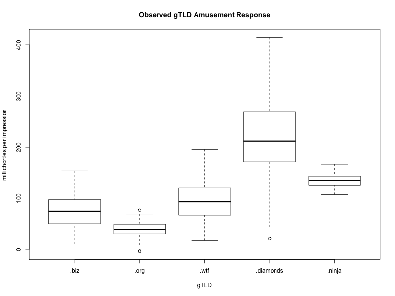

# FAQ

### Q: What's the difference between "classic" cowsay and cowsay-org?

Classic cowsay (AKA "rank amateur cowsay") is the original cowsay project by Tony Monroe.

Cowsay-org (this project) is Andrew Janke's 2016 fork of classic cowsay, intended to make cowsay readily available to a modern audience.

All the functionality, core code, and cows in cowsay come from Tony Monroe's classic cowsay. The GitHub hosting, project management, heavyweight software development process, and bureaucratic aspects are added by cowsay-org.

### Q: Does cowsay support J2EE or other Oracle Middleware?

Not at this time.

### Q: Does cowsay support PeopleSoft?

Not at this time.

### Q: Does cowsay support SOAP/XSD/WSDL bindings?
Not at this time.

### Q: Is there a CORBA binding for cowsay?

Not at this time.

### Q: Is there a COM/ActiveX control binding for cowsay?

Not at this time.

### Q: Why use .diamonds as the TLD for your web address?

Empirically speaking, .diamonds is the funniest gTLD for domain names.
While no whole-population studies have been done, existing field experiments with college students and frequent online media consumers demonstrate a clear advantage for .diamonds, with observed per-impression responses regularly in the 200 millichortle range.

We look forward to future research that provides a theoretical framework for the _a priori_ evaluation of the relative humor value of domain names, but as of yet little has been published in this area, so for now we have to rely on experimental results comparing extant TLDs and our own judgment.

### Q: Where can I find the repo for this website?

<https://github.com/cowsay-org/cowsay-www>

### Q: Is this a joke?

Yes, but it's only funny because we take it seriously.
