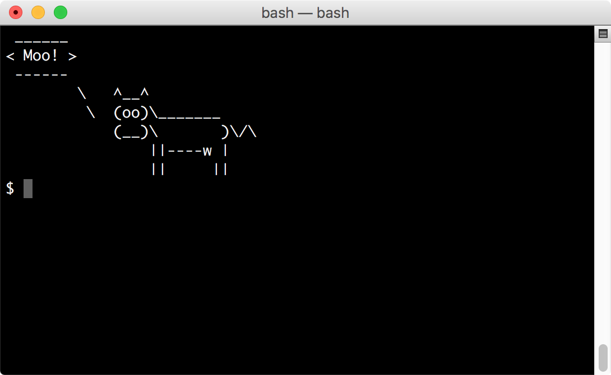

# Cowsay

Cowsay provides configurable talking cows at the terminal or other text presentation location.

## cowsay-org

This project you're looking at is Andrew Janke's fork of Tony Monroe's cowsay. It was created to provided ongoing maintenance and hosting for cowsay, and is an exercise in applying Open Source development and deployment practices to a small project. My hope is that this becomes the canonical modern fork of cowsay.

This forked project is called "cowsay-org" where needed to distinguish it from the original cowsay project. The program is still called "cowsay".

Cowsay was originally written by Tony Monroe. The cowsay-org updates primarily provide maintenance, hosting, and deployment support. The main functionality and code are from Tony Monroe. Anything involving bureaucracy and software development process were added by Andrew Janke and cowsay-org contributors.

Andrew Janke is on GitHub at [@apjanke](https://github.com/apjanke).

## License

Cowsay is licensed under the GNU General Public Licesne version 3 ("GPL-3.0"). (And partially dual-licensed under additional Open Source licenses.) See [LICENSE.txt](https://github.com/cowsay-org/cowsay/blob/master/LICENSE.txt) in its distribution for details.

## Installation

Download Cowsay from [the GitHub Releases page](https://github.com/cowsay-org/cowsay/releases) and follow the instructions in the distribution.

If you are using [Homebrew](https://brew.sh) on Mac (or Linux), you can install cowsay with Homebrew:

```
$ brew install cowsay
```

There is also a [`cowsay-org/cowsay` custom Tap](https://github.com/cowsay-org/homebrew-cowsay) with some supplemental cowsay-related formulae for use with `brew`.

## Development and Support

Source code for cowsay can be found on GitHub at <https://github.com/cowsay-org/cowsay>.

If you have issues with cowsay, please post an issue on [our GitHub issue tracker](https://github.com/cowsay-org/cowsay/issues).

If you would like to contribute to the development of cowsay, please start with [the Contributing Guide](https://github.com/cowsay-org/cowsay/blob/main/.github/CONTRIBUTING.md) in our main repo.

## History

Cowsay is actually a pretty old program. It was originally written by Tony Monroe and was first released in 1999, but was in use by Monroe for quite a while before that.

From Tony:

> The first major version of cowsay had one cow and one message template: $foo is $verb $bar.  Not very flexible, but people managed to do pretty interesting things with it.  The second major version scrapped many of the limitations of the first, by allowing arbitrary messages, multiple cowfiles, and even support for cows talking in figlet.  The third version was a rewrite of the second into Perl 5, whereupon the code got a lot smaller and more manageable. :-)

As of 2016, Monroe was no longer interested in maintaining cowsay, and published a [final 3.04 version of the source on GitHub](https://github.com/tnalpgge/rank-amateur-cowsay) to make it available to other developers. Andrew Janke, a cowsay fan, forked the project to provide ongoing maintenance and hosting for cowsay, and as an exercise in FLOSS development processes.

You can also find a copy of Tony's original cowsay web page [here on the Internet Archive's Wayback Machine](https://web.archive.org/web/20120225123719/http://www.nog.net/~tony/warez/cowsay.shtml).

## Requirements

Cowsay requires Perl 5.005_03 or later.

## Enjoy

Enjoy cowsay for what it was meant to be: simple and silly.
